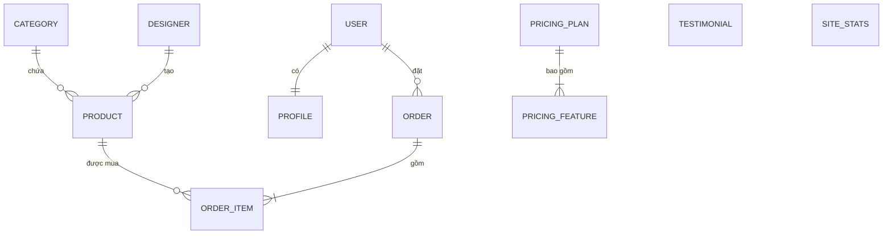
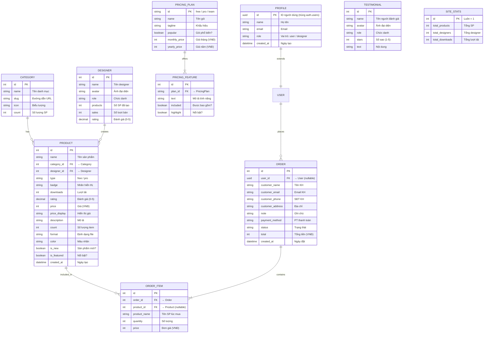
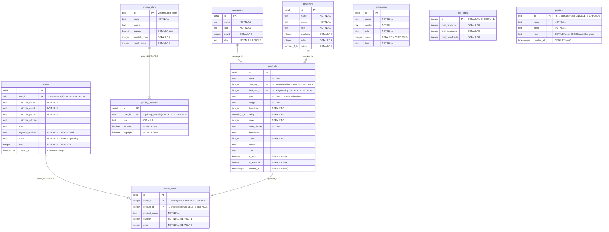

# DesignHub Marketplace — Entity Relationship Diagrams

> Xem trực tiếp trong VS Code (cài extension **Markdown Preview Mermaid Support**) hoặc dán vào [mermaid.live](https://mermaid.live).

---

## 1. Conceptual ERD

Bản đồ khái niệm — chỉ thể hiện các thực thể và mối quan hệ giữa chúng, không chứa thuộc tính.

### Mô tả quan hệ

| Thực thể | Quan hệ | Thực thể | Kiểu | Ghi chú |
|----------|---------|----------|------|---------|
| USER | đặt | ORDER | 1:N | Một user có nhiều đơn hàng |
| USER | có | PROFILE | 1:1 | Mỗi user có đúng 1 hồ sơ |
| CATEGORY | chứa | PRODUCT | 1:N | Một danh mục có nhiều sản phẩm |
| DESIGNER | tạo | PRODUCT | 1:N | Một designer tạo nhiều sản phẩm |
| ORDER | gồm | ORDER_ITEM | 1:N | Một đơn hàng có nhiều mục |
| PRODUCT | được mua | ORDER_ITEM | 1:N | Một sản phẩm xuất hiện trong nhiều mục |
| PRICING_PLAN | bao gồm | PRICING_FEATURE | 1:N | Một gói có nhiều tính năng |
| TESTIMONIAL | — | — | Độc lập | Đánh giá người dùng |
| SITE_STATS | — | — | Độc lập | Thống kê trang (1 hàng) |

---

## 2. Logical ERD

Mô hình logic — thể hiện thuộc tính chính, khóa chính (PK), khóa ngoại (FK), kiểu dữ liệu nghiệp vụ.

### Ghi chú mô hình logic

- **USER** được quản lý bởi Supabase Auth (`auth.users`), không có bảng riêng trong schema
- **PROFILE** mở rộng USER với trường `id` trùng với `auth.users.id` (quan hệ 1:1)
- **ORDER.user_id** nullable — cho phép khách vãng lai đặt hàng không cần đăng nhập
- **ORDER_ITEM.product_id** nullable — dùng `SET NULL` khi xóa SP, giữ lại tên SP trong `product_name` để lưu vết
- **ORDER_ITEM** snapshot giá (`price`) và tên (`product_name`) tại thời điểm mua, không phụ thuộc vào bảng products sau này

---

## 3. Physical ERD

Mô hình vật lý — chi tiết đầy đủ kiểu dữ liệu PostgreSQL, ràng buộc, giá trị mặc định, chính sách RLS.

### Chi tiết Physical

#### Kiểu dữ liệu

| Kiểu | Ý nghĩa | Dùng cho |
|------|----------|----------|
| `serial` | Tự tăng (integer) | PK của mọi bảng (trừ profiles, pricing_plans) |
| `uuid` | UUID v4 | profiles.id, orders.user_id (từ Supabase Auth) |
| `text` | Chuỗi không giới hạn | Hầu hết các trường chuỗi |
| `integer` | Số nguyên 4 byte | Giá (VNĐ), số lượng, đếm |
| `numeric(2,1)` | Số thập phân chính xác | rating (VD: 4.9) |
| `boolean` | Đúng/Sai | is_new, is_featured, popular, included... |
| `timestamptz` | Timestamp kèm timezone | created_at |

#### Ràng buộc CHECK

| Bảng | Trường | Ràng buộc |
|------|--------|-----------|
| `products` | type | `IN ('free', 'pro')` |
| `profiles` | role | `IN ('user', 'designer')` |
| `testimonials` | stars | `BETWEEN 1 AND 5` |
| `site_stats` | id | `= 1` (đảm bảo chỉ 1 hàng) |

#### Hành vi ON DELETE

| FK | Hành vi | Lý do |
|----|---------|-------|
| `products.category_id → categories(id)` | SET NULL | Xóa danh mục không xóa sản phẩm |
| `products.designer_id → designers(id)` | SET NULL | Xóa designer không xóa sản phẩm |
| `pricing_features.plan_id → pricing_plans(id)` | CASCADE | Xóa gói thì xóa luôn tính năng |
| `profiles.id → auth.users(id)` | CASCADE | Xóa user thì xóa hồ sơ |
| `orders.user_id → auth.users(id)` | SET NULL | Xóa user vẫn giữ đơn hàng (khách vãng lai) |
| `order_items.order_id → orders(id)` | CASCADE | Xóa đơn hàng thì xóa luôn mục |
| `order_items.product_id → products(id)` | SET NULL | Xóa sản phẩm vẫn giữ mục (lưu vết qua product_name) |

#### Row Level Security (RLS)

| Bảng | Chính sách |
|------|-----------|
| `products, categories, designers, pricing_plans, pricing_features, testimonials, site_stats` | Public read (anon + authenticated) |
| `profiles` | User chỉ đọc/sửa profile của mình (`auth.uid() = id`) |
| `orders` | User chỉ đọc đơn của mình; service_role toàn quyền |
| `order_items` | service_role toàn quyền |
